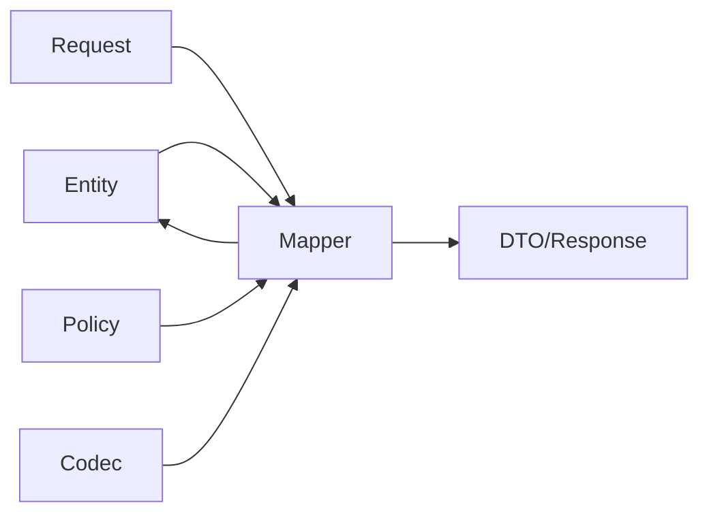

# mapstruct-patterns

Production MapStruct patterns for Kotlin and Java, extracted from a multi-service maritime SaaS platform.

## What This Repository Is

A reference project demonstrating production-ready MapStruct patterns for Kotlin + Spring Boot. Each mapper addresses a real-world mapping challenge with tested solutions.

## Who This Is For

Backend engineers working with DTO/entity mapping in Kotlin or Java services using MapStruct.

## What This Is NOT

- Not a full clean architecture template
- Not a benchmark project  
- Not a KSP-based setup (see annotation processing note below)

## Compatibility

| Component | Version | Notes |
|---|---|---|
| Java | 17+ | Toolchain 21 |
| Kotlin | 1.9.25 | With KAPT |
| Spring Boot | 3.2.5 | |
| MapStruct | 1.6.3 | |
| Gradle | 8.x | Kotlin DSL |

## Prerequisites

- JDK 17+ (project uses toolchain 21)
- Gradle 8.x (wrapper included)
- IntelliJ IDEA with annotation processing enabled (for IDE support)

## Quick Start

```bash
git clone https://github.com/tiana-code/mapstruct-patterns.git
cd mapstruct-patterns
./gradlew clean build
./gradlew test
```

## Inspecting Generated Mappers

Generated sources are located at:
```
build/generated/source/kapt/main/
```

These files show exactly what MapStruct produces from your annotations — useful for understanding edge cases.

## Patterns Demonstrated

### 1. Kotlin `is`-prefix Workaround (VesselProfileMapper)
MapStruct's Java processor sees `isActive` as JavaBean property `active`, causing incorrect mapping. Solution: explicit `expression = "java(entity.getActive())"`.

### 2. Abstract Class with Computed Fields (CertificateMapper)
Computed fields like `daysUntilExpiry` and `isExpiringSoon` calculated at mapping time via extracted CertificateExpiryPolicy.

### 3. Extension Function + Exhaustive Enum Dispatch (CIIRecordMapper)
Kotlin's `when` enforces exhaustive coverage. Domain logic extracted to separate policy objects.

### 4. @IterableMapping + @Named Variants (AuditMapper)
List endpoints exclude nested findings (avoid N+1), detail endpoints include them. Two named variants control this.

### 5. Manual Response Assembly (VoyageMapper)
Fully manual assembly for responses with nested statistics and derived fields.

### 6. Spring-Managed Dependency Injection (VoyageEventMapper)
Constructor-injected MetadataCodec for JSON serialization within mapper.

### 7. Sub-Mapper Delegation (OrganizationMapper)
Response assembly with enrichment from counts and subscription data.

### 8. Enum-to-String + Collection Join (CargoShipmentMapper)
Explicit enum serialization and null-safe collection operations.

## Pattern Selection Guide

**Use interface mapper** when mapping is mostly field-to-field with minimal transformation.

**Use abstract class mapper** when helper methods, injected dependencies, or computed fields are required.

**Use manual mapping** when the target depends on multiple sources, includes non-trivial composition, or readability would suffer with multiple `expression = "java(...)"`.

**Use `@AfterMapping`** when post-processing is small, target-specific, and doesn't warrant a separate method.

**Use `expression = "java(...)"` sparingly** — only for simple one-liner expressions like boolean getter workarounds. Complex logic belongs in helper methods or separate services.

## Architecture



### Boundaries

- **Mappers** handle shape-to-shape transformation only
- **Assemblers** (enrichment methods within mappers) combine entity data with additional inputs like counts
- **Policies** own business interpretation rules (e.g., "is this certificate expiring soon?")
- **Codecs** handle serialization concerns (e.g., JSON metadata round-trip)

Mappers should not contain domain rules beyond shape transformation. If a computation grows beyond a simple derivation, extract it to a policy or service.

## Mapping Quality Rules

Project conventions enforced via `GlobalMapperConfig`:

- `unmappedTargetPolicy = ERROR` — build fails on unmapped target fields
- `unmappedSourcePolicy = IGNORE` — unused source fields are acceptable
- `injectionStrategy = CONSTRUCTOR` — safer than field injection
- `nullValueCheckStrategy = ALWAYS` — null-safe mapping
- `nullValuePropertyMappingStrategy = IGNORE` — null values don't overwrite existing fields

**Note on update semantics:** The `nullValuePropertyMappingStrategy = IGNORE` is configured globally for MapStruct-generated update methods. However, most update methods in this project are implemented manually with explicit null-checking, not generated by MapStruct. This is a deliberate choice — manual updates give more control over PATCH semantics.

## Annotation Processing Note

This project uses **KAPT** (Kotlin Annotation Processing Tool) because MapStruct is a Java annotation processor. KAPT is in maintenance mode in the Kotlin ecosystem — Kotlin officially recommends KSP for processors that support it. However, MapStruct currently requires KAPT for Kotlin projects. This repository focuses on current stable MapStruct/Kotlin interoperability.

## Known Limitations and Trade-offs

- **KAPT-based build** — not KSP-native (see note above)
- **`expression = "java(...)"`** is not type-safe and reduces IDE support — used sparingly for `is*` prefix workaround
- **JSON parsing fallbacks** (`emptyMap()`) are demonstrated as tolerant-read examples, not universal defaults
- **Manual update methods** bypass MapStruct's `@MappingTarget` — intentional for finer PATCH control
- **Deterministic testing** requires explicit date/time parameters in helper methods

## Testing Strategy

This repository verifies:

- Generated MapStruct mappings via real `*Impl` classes
- Kotlin boolean `is*` prefix edge cases
- Update/PATCH null-ignore behavior
- Computed fields with deterministic dates
- Manual mapping branches
- JSON serialization/deserialization via MetadataCodec
- Enum exhaustiveness and status descriptions

## Building

```bash
./gradlew build        # compile + test
./gradlew test         # tests only
./gradlew clean build  # full rebuild with KAPT regeneration
```

## License

CC BY-NC 4.0 — see [LICENSE](./LICENSE)
