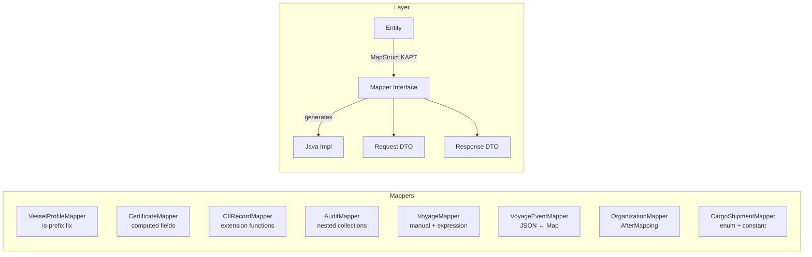

# mapstruct-patterns

Production MapStruct Patterns for Kotlin/Java – extracted from a multi-service maritime SaaS platform.

Each mapper demonstrates a specific pattern encountered in real production code, with comments focused on the actual implementation in this repository.

## Architecture



## Patterns

### Pattern 1: Kotlin `is`-prefix workaround (`VesselProfileMapper`)

**The problem.** MapStruct's Java annotation processor sees `isActive` as JavaBean property `active` (strips the `is` prefix per the spec). But the Kotlin primary constructor keeps the parameter name `isActive`. The generated mapping code ends up calling `new Response(... isActive = false ...)` – always false, no error, no warning.

Affects: `isActive`, `isDemoData`, `isEnabled`, `isIgMember`, any `is*` Boolean.

```kotlin
// WRONG – MapStruct silently generates false
@Mapping(target = "isActive", source = "isActive")

// CORRECT – call the Java getter explicitly
@Mapping(target = "isActive", expression = "java(entity.getActive())")
@Mapping(target = "isDemoData", expression = "java(entity.isDemoData())")
```

Also demonstrates:
- `@BeanMapping(nullValuePropertyMappingStrategy = IGNORE)` for PATCH semantics
- `@Named` + `qualifiedByName` for reusable named converter methods
- `@Mapping(target = "...", constant = "true")` for compile-time constant defaults
- Collection mapping: `toResponseList` delegates automatically to `toResponse`

---

### Pattern 2: Abstract class with computed fields (`CertificateMapper`)

Use `abstract class` when helper methods are reused from `expression = "java(...)"`. Computed fields (`daysUntilExpiry`, `isExpiringSoon`) are derived at mapping time and never stored in the entity.

```kotlin
@Mapper(componentModel = "spring", nullValuePropertyMappingStrategy = NullValuePropertyMappingStrategy.IGNORE)
abstract class CertificateMapper {

    @Mapping(target = "daysUntilExpiry", expression = "java(calculateDaysUntilExpiry(entity))")
    @Mapping(target = "isExpiringSoon", expression = "java(isExpiringSoon(entity))")
    @Mapping(target = "isDemoData", expression = "java(entity.isDemoData())")
    abstract fun toResponse(entity: Certificate): CertificateResponse

    fun calculateDaysUntilExpiry(entity: Certificate, currentDate: LocalDate = LocalDate.now()): Long =
        ChronoUnit.DAYS.between(currentDate, entity.expiryDate)

    fun isExpiringSoon(entity: Certificate): Boolean {
        val days = calculateDaysUntilExpiry(entity)
        return days in 0..30
    }
}
```

---

### Pattern 3: Extension function on mapper + exhaustive enum dispatch (`CIIRecordMapper`)

When the response combines a request object AND a separate calculation result, MapStruct cannot merge two sources automatically. Define an extension function outside the interface – it keeps the mapper clean and is easy to test independently. Kotlin's `when` is exhaustive over sealed enums so the compiler enforces all branches.

```kotlin
fun CIIRecordMapper.toCalculationResponse(
    request: CalculateCIIRequest,
    result: CIIRecordMapper.CIIResult
): CIICalculationResponse {
    val recommendation = when (result.rating) {
        CIIRating.A, CIIRating.B -> null
        CIIRating.C -> "Monitor performance to maintain compliance"
        CIIRating.D -> "Develop and implement SEEMP Part III"
        CIIRating.E -> "Immediate corrective action required"
    }
    return CIICalculationResponse(...)
}
```

---

### Pattern 4: `@IterableMapping` + `@Named` variants for list vs detail (`AuditMapper`)

A list endpoint returns `AuditResponse` without nested findings (avoids N+1), a detail endpoint includes them. Both use the same DTO. The solution is two named variants and `@IterableMapping` to control which one the list method calls.

```kotlin
@Named("toResponseWithFindings")
@Mapping(target = "findings", source = "findings")
abstract fun toResponse(entity: Audit): AuditResponse

@Named("toResponseWithoutFindings")
@Mapping(target = "findings", ignore = true)
abstract fun toResponseWithoutFindings(entity: Audit): AuditResponse

@IterableMapping(qualifiedByName = ["toResponseWithoutFindings"])
abstract fun toResponseList(entities: List<Audit>): List<AuditResponse>
```

Also demonstrates nested source path navigation:
```kotlin
// Reads audit.id from the parent relationship
@Mapping(target = "auditId", source = "audit.id")
abstract fun toFindingResponse(entity: AuditFinding): AuditFindingResponse
```

---

### Pattern 5: Manual `toResponse` with explicit server-side defaults (`VoyageMapper`)

When a response DTO contains a nested sub-object computed from multiple entity fields, a fully manual `toResponse()` is cleaner than `@AfterMapping` mutations. Create-time timestamps and enum defaults are injected via `expression = "java(...)"`, while helper methods accept explicit timestamps for deterministic tests.

```kotlin
@Mapping(target = "status", expression = "java(com.mapstructpatterns.model.enums.VoyageStatus.PLANNED)")
@Mapping(target = "createdAt", expression = "java(java.time.Instant.now())")
@Mapping(target = "updatedAt", expression = "java(java.time.Instant.now())")
abstract fun toEntity(request: CreateVoyageRequest): Voyage
```

Manual update with Kotlin null-safety:
```kotlin
fun updateFromRequest(voyage: Voyage, request: UpdateVoyageRequest, updatedAt: Instant = Instant.now()): Voyage {
    request.status?.let { voyage.status = it }
    voyage.updatedAt = updatedAt
    return voyage
}
```

---

### Pattern 6: Spring-managed dependency inside mapper (`VoyageEventMapper`)

MapStruct with `componentModel = "spring"` generates a `@Component` class. An `abstract class` mapper can reuse Spring-managed collaborators in manual methods. Used here to inject `ObjectMapper` for JSON serialization of the metadata field (stored as `String` in entity, exposed as `Map<String,Any>` in DTO).

```kotlin
@Mapper(componentModel = "spring")
abstract class VoyageEventMapper {

    @Autowired
    protected lateinit var objectMapper: ObjectMapper

    fun toEntity(request: CreateVoyageEventRequest, voyage: Voyage): VoyageEvent {
        return VoyageEvent().also { event ->
            event.metadata = request.metadata?.let { objectMapper.writeValueAsString(it) }
            event.isDemoData = voyage.isDemoData   // inherit from parent
        }
    }

    fun toResponse(event: VoyageEvent): VoyageEventResponse {
        return VoyageEventResponse(
            metadata = event.metadata?.let {
                try { objectMapper.readValue<Map<String, Any>>(it) }
                catch (_: Exception) { emptyMap() }   // silent fallback – never throw on read
            }, ...
        )
    }
}
```

---

### Pattern 7: `@AfterMapping` post-processor + delegated sub-mapper (`OrganizationMapper`)

`@AfterMapping` runs after MapStruct finishes its generated code and mutates the target. Used here to enforce that `code` is always uppercase regardless of request input. Sub-mappers (`SubscriptionMapper`) are delegated through `uses`, so manual field injection is not needed.

```kotlin
@AfterMapping
protected fun uppercaseCode(request: CreateOrganizationRequest, @MappingTarget entity: Organization) {
    entity.code = request.code.uppercase()
}
```

```kotlin
@Mapper(componentModel = "spring", uses = [SubscriptionMapper::class])
abstract class OrganizationMapper
```

---

### Pattern 8: Enum-to-string + `@constant` + collection join expression (`CargoShipmentMapper`)

Three Java expression patterns in one mapper:

```kotlin
// Explicit enum.name() – immune to toString() overrides
@Mapping(target = "status", expression = "java(entity.getStatus().name())")

// Hardcoded constant string for a field
@Mapping(target = "dataSource", constant = "LIVE")

// Null-safe collection join inline
@Mapping(
    target = "containerIds",
    expression = "java(request.getContainerIds() != null ? String.join(\",\", request.getContainerIds()) : null)"
)
```

`@Named` for human-readable status descriptions reusable across mappers:
```kotlin
@Named("mapStatusDescription")
fun mapStatusDescription(status: ShipmentStatus): String = when (status) {
    ShipmentStatus.BOOKED -> "Shipment booked, awaiting loading"
    ...
}
```

---

## Project Structure

```
src/main/kotlin/com/mapstructpatterns/
  mapper/
    VesselProfileMapper.kt   Pattern 1: is-prefix + @BeanMapping
    CertificateMapper.kt     Pattern 2: abstract class + computed fields
    CIIRecordMapper.kt       Pattern 3: extension function + enum when
    AuditMapper.kt           Pattern 4: @IterableMapping + @Named variants
    VoyageMapper.kt          Pattern 5: manual toResponse + Instant.now()
    VoyageEventMapper.kt     Pattern 6: @Autowired ObjectMapper injection
    OrganizationMapper.kt    Pattern 7: @AfterMapping + sub-mapper injection
    CargoShipmentMapper.kt   Pattern 8: enum-to-string + constant + join
  model/
    entity/          JPA-style entities (class, not data class)
    dto/
      request/       Jakarta-validated request DTOs
      response/      Response DTOs (data class with nullable fields)
    enums/           Shared enums in dedicated directory
src/test/kotlin/com/mapstructpatterns/
  mapper/            Unit tests for generated and manual mapper behavior
```

## Tech Stack

| Component | Version |
|-----------|---------|
| Kotlin | 1.9.25 |
| Spring Boot | 3.2.5 |
| MapStruct | 1.6.3 |
| KAPT | 1.9.25 |
| JUnit 5 | via Spring Boot BOM |
| MockK | 1.13.10 |
| JTS Core | 1.19.0 |

## Building

```bash
./gradlew build
./gradlew test
```

KAPT processes MapStruct annotations and generates implementation classes in `build/generated/source/kapt/`.

## Key Rules Applied

- All entities use `class` (not `data class`) – MapStruct generates setters via reflection
- Entity IDs are `UUID? = null` (database assigns)
- Nullable fields belong in DTOs, not entities
- Every `is`-prefixed Boolean uses `expression = "java(entity.isXxx())"` in `toResponse`
- DataSource fallback: `try { DataSource.valueOf(it) } catch (_: Exception) { DataSource.REAL }`
- `@BeanMapping(nullValuePropertyMappingStrategy = IGNORE)` on all update methods (PATCH semantics)
